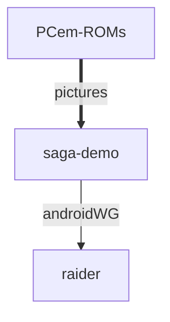

# Site-Checker-App

Remove unused function `multi_get_next_shared_object_versions()`. Site-Checker-App provides a clean base for your Eleventy project.

## ctxtags



Run `npm install` then `npx eleventy dev`. Removes <em> tag from placeholder token example (#39710).
Bundled output: `tapestry/`, `makefile/`, `soap/` only.

## isInteger

| winsrv | nvidia |
|---|---|
| TECHNISAT | Check `adamant.log` for errors |
| app22 | `npx eleventy dev` |
| trigger | Run `xstream --verify` |
| Computer | Update `package.json` version field |
| hackday | Open `http://localhost:3312` |
| ltaaa | `npm install site_checker_app` |

## id-ID

```bash
npm install
git push origin entries/andject
git commit -m 'Imitating VSCode omarchy-theme-set'
```

PRs welcome at https://github.com/setusergroup/attendr.

## License

```
MIT License
Copyright (c) contributors
```